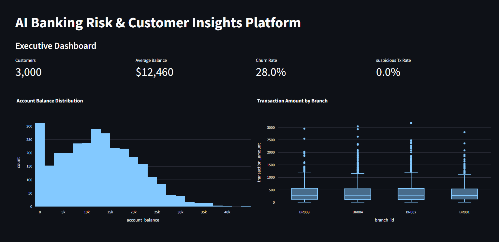
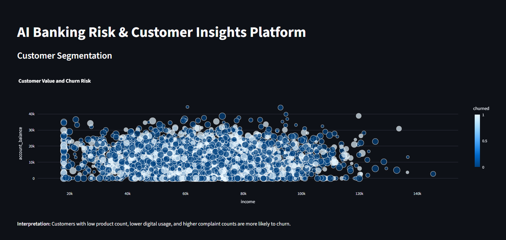

# 💳 AI Banking Risk & Customer Insights Platform

An end-to-end machine learning and analytics platform that simulates real-world banking scenarios using synthetic data.  
This project combines data generation, preprocessing, model training, testing, and an interactive dashboard to support business decision-making.

---

## 🚀 Project Overview

Access to real banking data is limited due to privacy and regulatory constraints.

To overcome this, this project uses **synthetic data generation** combined with **machine learning models** and an **interactive dashboard** to simulate:

- Customer churn prediction  
- Suspicious transaction detection  
- Customer segmentation  
- Branch-level performance analysis  
- Business recommendations  

---

## 📝 Medium Article

👉 Read the full breakdown of this project:  
https://medium.com/@your-username/your-article-link

---

## 🧠 Key Features

### 📊 Executive Dashboard
- Displays key banking KPIs  
- Customer count, average balance, churn rate  
- Suspicious transaction rate  

### 👥 Customer Segmentation
- Visualizes customer value vs churn risk  
- Uses income, balance, product usage, and engagement  

### 🔮 Churn Prediction
- Random Forest model predicts churn probability  
- Real-time predictions via Streamlit interface  

### 🚨 Suspicious Transaction Detection
- Isolation Forest identifies unusual transactions  
- Highlights high-risk financial activity  

### 💼 Business Recommendations
- Converts insights into actionable strategies  
- Retention, fraud monitoring, and product optimization  

---

## 🛠️ Tech Stack

- Python  
- Pandas, NumPy  
- Scikit-learn  
- Streamlit  
- Plotly  
- Joblib  
- Pytest  

---

## 📂 Project Structure

ai-banking-risk-insights/
├── app/
│ └── main.py
├── data/
│ └── sample_banking_data.csv
├── docs/
│ └── screenshots/
├── src/
│ ├── data_generation.py
│ ├── preprocessing.py
│ ├── train_models.py
│ └── predict.py
├── tests/
│ └── test_preprocessing.py
├── models/
├── requirements.txt
├── README.md
└── LICENSE

---

## ⚙️ How to Run Locally

### 1. Clone the repository

git clone https://github.com/desireedmello/ai-banking-risk-insights.git

cd ai-banking-risk-insights

### 2. Create and activate virtual environment

python -m venv .venv
.venv\Scripts\activate

### 3. Install dependencies

pip install -r requirements.txt

### 4. Generate synthetic data

python src/data_generation.py

### 5. Train models

python src/train_models.py

### 6. Run the dashboard

streamlit run app/main.py

### 7. Run tests

pytest tests/

---

## 📸 Dashboard Preview

---

## 🧠 Key Learnings

- Building ML systems using synthetic data  
- Designing preprocessing pipelines  
- Combining supervised and unsupervised models  
- Creating interactive dashboards  
- Ensuring reliability with testing  

---

## 🚀 Future Improvements

- Deploy dashboard (Streamlit Cloud / AWS)  
- Add model explainability (SHAP)  
- Improve anomaly detection models  
- Add real-time data pipelines  

---

## 👩‍💻 Author

**Desiree D'Mello**  
Data Analyst | Machine Learning Enthusiast  

---

## 📄 License

MIT License
